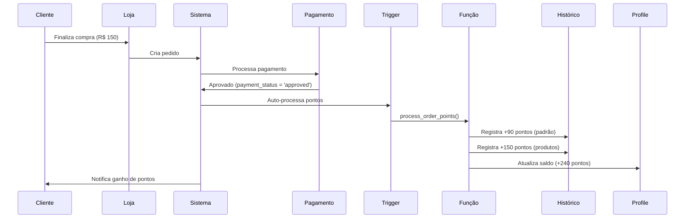
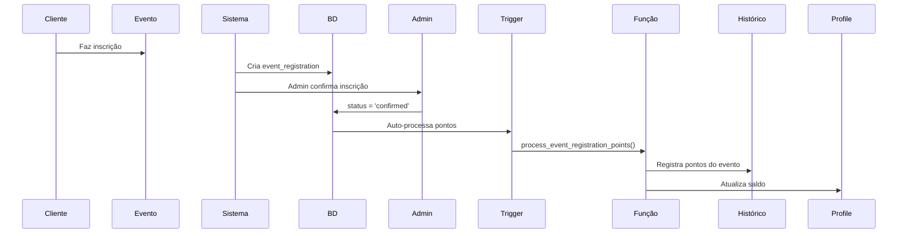

# 🎮 Sistema CyberPoints - Programa de Fidelidade

## 📋 Visão Geral

O **CyberPoints** é um sistema completo de pontuação/fidelidade integrado ao CyberLife. Permite que clientes acumulem pontos em compras, eventos e promoções especiais, gamificando a experiência de compra.

## ⭐ Características Principais

### 1. **Pontuação Automática**
- Cada novo usuário começa com **0 CyberPoints**
- Pontos creditados automaticamente quando pagamento é aprovado
- Sistema totalmente auditável com histórico completo

### 2. **Regras de Pontuação**

#### Regra Padrão (Compras)
- **A cada R$ 50,00 gastos = 30 pontos**
- Exemplos:
  - R$ 50,00 → 30 pontos
  - R$ 100,00 → 60 pontos
  - R$ 150,00 → 90 pontos
  - R$ 45,00 → 0 pontos (não atingiu o mínimo)

#### Pontos Customizados
- **Produtos**: Campo opcional `reward_points`
  - Se preenchido: cliente ganha os pontos cadastrados
  - Se NULL: usa regra padrão (R$ 50 = 30 pontos)
  
- **Banners**: Campo opcional `reward_points`
  - Para promoções especiais e campanhas
  
- **Eventos**: Campo opcional `reward_points`
  - Pontos creditados quando inscrição é confirmada

### 3. **Exemplo Prático**

```
Cliente faz uma compra de R$ 150,00 com os seguintes itens:

Item 1: Mouse Gamer - R$ 80,00 (100 pontos cadastrados)
Item 2: Mousepad - R$ 40,00 (sem pontos cadastrados)
Item 3: Cabo USB - R$ 30,00 (50 pontos cadastrados)

CÁLCULO DOS PONTOS:
1. Pontos dos produtos: 100 + 50 = 150 pontos
2. Pontos pela regra padrão: R$ 150 ÷ 50 × 30 = 90 pontos
3. TOTAL: 150 + 90 = 240 CyberPoints! 🎉
```

## 🗄️ Estrutura do Banco de Dados

### Tabelas Modificadas

#### `profiles`
```sql
ALTER TABLE profiles 
ADD COLUMN cyber_points INTEGER DEFAULT 0 CHECK (cyber_points >= 0);
```
- Armazena saldo atual de pontos do usuário

#### `products`
```sql
ALTER TABLE products 
ADD COLUMN reward_points INTEGER DEFAULT NULL CHECK (reward_points IS NULL OR reward_points >= 0);
```
- Pontos customizados por produto (opcional)

#### `banners`
```sql
ALTER TABLE banners 
ADD COLUMN reward_points INTEGER DEFAULT NULL CHECK (reward_points IS NULL OR reward_points >= 0);
```
- Pontos para promoções especiais

#### `events`
```sql
ALTER TABLE events 
ADD COLUMN reward_points INTEGER DEFAULT NULL CHECK (reward_points IS NULL OR reward_points >= 0);
```
- Pontos para participação em eventos

### Nova Tabela: `cyber_points_history`

```sql
CREATE TABLE cyber_points_history (
  id BIGSERIAL PRIMARY KEY,
  user_id UUID NOT NULL,
  points INTEGER NOT NULL,
  type TEXT NOT NULL,  -- 'earned', 'spent', 'refunded', 'expired', 'bonus', 'adjustment'
  source TEXT NOT NULL,  -- 'purchase', 'product', 'event', 'banner', 'promotion', 'referral', 'admin', 'other'
  description TEXT NOT NULL,
  reference_id BIGINT,
  reference_type TEXT,  -- 'order', 'product', 'event', 'banner'
  balance_before INTEGER NOT NULL,
  balance_after INTEGER NOT NULL,
  created_at TIMESTAMP WITH TIME ZONE DEFAULT NOW(),
  created_by UUID
);
```

**Propósito**: Registrar todas as transações de pontos para auditoria completa.

## 🔧 Funções Principais

### 1. `calculate_purchase_points(total_amount)`
Calcula pontos baseado no valor total da compra.

```sql
SELECT calculate_purchase_points(150.00);
-- Retorna: 90 (R$ 150 ÷ 50 × 30)
```

### 2. `add_cyber_points(...)`
Adiciona ou remove pontos de um usuário com registro no histórico.

```sql
-- Adicionar pontos
SELECT add_cyber_points(
  'user-uuid'::UUID,
  100,  -- quantidade
  'bonus',  -- tipo
  'promotion',  -- origem
  'Bônus de boas-vindas'  -- descrição
);

-- Remover pontos (número negativo)
SELECT add_cyber_points(
  'user-uuid'::UUID,
  -50,  -- quantidade negativa
  'spent',
  'other',
  'Resgate de pontos'
);
```

### 3. `process_order_points(order_id)`
Processa e credita pontos de um pedido específico.

```sql
SELECT process_order_points(123);
```

Retorna:
```json
{
  "success": true,
  "order_id": 123,
  "order_number": "CL-20260113-000123",
  "total_points_earned": 240,
  "product_points": 150,
  "purchase_points": 90
}
```

### 4. `process_event_registration_points(registration_id)`
Processa pontos quando usuário se inscreve em evento.

```sql
SELECT process_event_registration_points(45);
```

### 5. `get_user_points(user_id)`
Retorna saldo atual de pontos do usuário.

```sql
SELECT get_user_points('user-uuid'::UUID);
-- Retorna: 350
```

### 6. `has_enough_points(user_id, required_points)`
Verifica se usuário tem pontos suficientes.

```sql
SELECT has_enough_points('user-uuid'::UUID, 100);
-- Retorna: true ou false
```

## 🤖 Automação (Triggers)

### Trigger: Processar Pontos de Pedidos
```sql
-- Acionado quando payment_status muda para 'approved'
CREATE TRIGGER trigger_auto_process_order_points
  AFTER UPDATE ON orders
  FOR EACH ROW
  EXECUTE FUNCTION auto_process_order_points();
```

### Trigger: Processar Pontos de Eventos
```sql
-- Acionado quando inscrição é confirmada
CREATE TRIGGER trigger_auto_process_event_points
  AFTER INSERT OR UPDATE ON event_registrations
  FOR EACH ROW
  EXECUTE FUNCTION auto_process_event_points();
```

## 📊 Views Úteis

### `cyber_points_ranking`
Ranking dos top 100 usuários com mais pontos.

```sql
SELECT * FROM cyber_points_ranking LIMIT 10;
```

Resultado:
```
rank | nickname    | cyber_points
-----|-------------|-------------
1    | gamer_pro   | 5420
2    | player_one  | 4890
3    | cybergirl   | 3200
...
```

### `user_points_summary`
Resumo completo de pontos por usuário.

```sql
SELECT * FROM user_points_summary WHERE user_id = 'user-uuid';
```

Resultado:
```json
{
  "user_id": "uuid",
  "nickname": "gamer_pro",
  "current_balance": 1250,
  "total_earned": 2000,
  "total_spent": 750,
  "total_transactions": 45,
  "last_activity": "2026-01-13T10:30:00Z"
}
```

## 🔒 Segurança (RLS - Row Level Security)

### Políticas Implementadas

```sql
-- Usuários podem ver seu próprio histórico
CREATE POLICY "Users can view own points history"
  ON cyber_points_history FOR SELECT
  USING (auth.uid() = user_id);

-- Admin pode ver todo o histórico
CREATE POLICY "Admin can view all points history"
  ON cyber_points_history FOR SELECT
  USING (
    EXISTS (
      SELECT 1 FROM profiles
      WHERE id = auth.uid() AND is_admin = true
    )
  );
```

## 📱 Integração com Frontend

### Exemplo: Exibir Pontos do Usuário

```javascript
// Buscar saldo de pontos
const { data: profile } = await supabase
  .from('profiles')
  .select('cyber_points, nickname')
  .eq('id', userId)
  .single();

console.log(`${profile.nickname} tem ${profile.cyber_points} CyberPoints`);
```

### Exemplo: Histórico de Pontos

```javascript
// Buscar histórico dos últimos 30 dias
const { data: history } = await supabase
  .from('cyber_points_history')
  .select('*')
  .eq('user_id', userId)
  .gte('created_at', new Date(Date.now() - 30*24*60*60*1000).toISOString())
  .order('created_at', { ascending: false });

history.forEach(transaction => {
  console.log(`${transaction.type}: ${transaction.points} pontos - ${transaction.description}`);
});
```

### Exemplo: Ranking

```javascript
// Buscar top 10 do ranking
const { data: ranking } = await supabase
  .from('cyber_points_ranking')
  .select('*')
  .limit(10);

ranking.forEach((user, index) => {
  console.log(`#${index + 1} - ${user.nickname}: ${user.cyber_points} pontos`);
});
```

### Exemplo: Cadastrar Produto com Pontos

```javascript
// Admin cadastrando produto com pontos customizados
const { data, error } = await supabase
  .from('products')
  .insert({
    name: 'Mouse Gamer RGB',
    price: 89.90,
    reward_points: 150,  // Cliente ganha 150 pontos ao comprar
    category: 'Periféricos',
    // ... outros campos
  });
```

### Exemplo: Cadastrar Evento com Pontos

```javascript
// Admin cadastrando evento com pontos
const { data, error } = await supabase
  .from('events')
  .insert({
    title: 'Torneio League of Legends',
    date: '2026-02-15',
    reward_points: 500,  // Participantes ganham 500 pontos
    // ... outros campos
  });
```

## 🎯 Casos de Uso

### 1. Cliente Faz uma Compra



### 2. Cliente se Inscreve em Evento



### 3. Admin Adiciona Bônus Manual

```javascript
// Admin dando pontos de bônus
const result = await supabase.rpc('add_cyber_points', {
  p_user_id: 'user-uuid',
  p_points: 1000,
  p_type: 'bonus',
  p_source: 'promotion',
  p_description: 'Promoção de Aniversário - 1000 pontos bônus!',
  p_created_by: adminUserId
});

if (result.data.success) {
  console.log('Pontos adicionados com sucesso!');
  console.log(`Novo saldo: ${result.data.balance_after}`);
}
```

## 📈 Relatórios e Análises

### Produtos Mais Rentáveis (em Pontos)

```sql
SELECT 
  p.name,
  p.reward_points,
  COUNT(DISTINCT h.user_id) as usuarios_beneficiados,
  SUM(h.points) as total_pontos_distribuidos
FROM cyber_points_history h
JOIN products p ON p.id = h.reference_id
WHERE h.reference_type = 'product'
GROUP BY p.id, p.name, p.reward_points
ORDER BY total_pontos_distribuidos DESC
LIMIT 10;
```

### Usuários Mais Ativos

```sql
SELECT 
  p.nickname,
  p.cyber_points as saldo_atual,
  COUNT(h.id) as total_transacoes,
  SUM(CASE WHEN h.type = 'earned' THEN h.points ELSE 0 END) as total_ganho,
  SUM(CASE WHEN h.type = 'spent' THEN ABS(h.points) ELSE 0 END) as total_gasto
FROM profiles p
LEFT JOIN cyber_points_history h ON h.user_id = p.id
GROUP BY p.id, p.nickname, p.cyber_points
HAVING COUNT(h.id) > 0
ORDER BY total_transacoes DESC
LIMIT 20;
```

### Distribuição de Pontos por Mês

```sql
SELECT 
  DATE_TRUNC('month', created_at) as mes,
  SUM(CASE WHEN type = 'earned' THEN points ELSE 0 END) as pontos_distribuidos,
  COUNT(DISTINCT user_id) as usuarios_ativos
FROM cyber_points_history
WHERE type = 'earned'
GROUP BY DATE_TRUNC('month', created_at)
ORDER BY mes DESC;
```

## 🚀 Instalação

### Passo 1: Executar SQL
```bash
# No Supabase Dashboard > SQL Editor
# Cole e execute o arquivo: add-cyberpoints-system.sql
```

### Passo 2: Verificar Instalação
```sql
-- Verificar tabelas
SELECT table_name FROM information_schema.tables 
WHERE table_name LIKE '%cyber_points%';

-- Verificar funções
SELECT routine_name FROM information_schema.routines 
WHERE routine_name LIKE '%points%';

-- Verificar triggers
SELECT trigger_name FROM information_schema.triggers 
WHERE trigger_name LIKE '%points%';
```

### Passo 3: Testar Sistema
```sql
-- Criar usuário de teste (se necessário)
-- Ver saldo inicial (deve ser 0)
SELECT cyber_points FROM profiles WHERE id = 'test-user-uuid';

-- Adicionar pontos manualmente
SELECT add_cyber_points(
  'test-user-uuid'::UUID,
  100,
  'bonus',
  'admin',
  'Teste do sistema'
);

-- Verificar histórico
SELECT * FROM cyber_points_history WHERE user_id = 'test-user-uuid';
```

## 🎨 Sugestões de UI/UX

### Componente: Badge de Pontos
```jsx
function CyberPointsBadge({ points }) {
  return (
    <div className="cyber-points-badge">
      <span className="icon">🎮</span>
      <span className="points">{points.toLocaleString()}</span>
      <span className="label">CyberPoints</span>
    </div>
  );
}
```

### Componente: Histórico de Pontos
```jsx
function PointsHistory({ userId }) {
  const [history, setHistory] = useState([]);

  useEffect(() => {
    fetchHistory();
  }, [userId]);

  const fetchHistory = async () => {
    const { data } = await supabase
      .from('cyber_points_history')
      .select('*')
      .eq('user_id', userId)
      .order('created_at', { ascending: false })
      .limit(20);
    
    setHistory(data);
  };

  return (
    <div className="points-history">
      <h3>Histórico de Pontos</h3>
      {history.map(transaction => (
        <div key={transaction.id} className="transaction-item">
          <span className={`type ${transaction.type}`}>
            {transaction.type === 'earned' ? '+' : '-'}
            {Math.abs(transaction.points)}
          </span>
          <span className="description">{transaction.description}</span>
          <span className="date">
            {new Date(transaction.created_at).toLocaleDateString()}
          </span>
        </div>
      ))}
    </div>
  );
}
```

### Componente: Ranking
```jsx
function PointsRanking() {
  const [ranking, setRanking] = useState([]);

  useEffect(() => {
    fetchRanking();
  }, []);

  const fetchRanking = async () => {
    const { data } = await supabase
      .from('cyber_points_ranking')
      .select('*')
      .limit(10);
    
    setRanking(data);
  };

  return (
    <div className="points-ranking">
      <h2>🏆 Top CyberGamers</h2>
      <ol className="ranking-list">
        {ranking.map((user, index) => (
          <li key={user.id} className={`rank-${index + 1}`}>
            <span className="position">#{index + 1}</span>
            
            <span className="nickname">{user.nickname}</span>
            <span className="points">{user.cyber_points.toLocaleString()} pts</span>
          </li>
        ))}
      </ol>
    </div>
  );
}
```

## 💡 Ideias de Expansão

### 1. Sistema de Níveis
```sql
CREATE TYPE user_level AS ENUM ('Bronze', 'Prata', 'Ouro', 'Platina', 'Diamante', 'Mestre');

ALTER TABLE profiles 
ADD COLUMN level user_level DEFAULT 'Bronze',
ADD COLUMN level_points INTEGER DEFAULT 0;

-- Função para calcular nível baseado em pontos totais ganhos
CREATE FUNCTION calculate_user_level(total_earned INTEGER) 
RETURNS user_level AS $$
BEGIN
  RETURN CASE
    WHEN total_earned < 1000 THEN 'Bronze'
    WHEN total_earned < 5000 THEN 'Prata'
    WHEN total_earned < 15000 THEN 'Ouro'
    WHEN total_earned < 50000 THEN 'Platina'
    WHEN total_earned < 100000 THEN 'Diamante'
    ELSE 'Mestre'
  END;
END;
$$ LANGUAGE plpgsql;
```

### 2. Resgate de Pontos
```sql
CREATE TABLE point_rewards (
  id BIGSERIAL PRIMARY KEY,
  title TEXT NOT NULL,
  description TEXT,
  points_required INTEGER NOT NULL,
  reward_type TEXT CHECK (reward_type IN ('discount', 'product', 'shipping', 'other')),
  reward_value DECIMAL(10,2),
  active BOOLEAN DEFAULT true
);

-- Função para resgatar pontos
CREATE FUNCTION redeem_points(
  p_user_id UUID,
  p_reward_id BIGINT
) RETURNS JSONB AS $$
-- Implementação do resgate
$$;
```

### 3. Pontos com Expiração
```sql
ALTER TABLE cyber_points_history 
ADD COLUMN expires_at TIMESTAMP WITH TIME ZONE;

-- Trigger para expirar pontos antigos
CREATE FUNCTION expire_old_points() 
RETURNS void AS $$
-- Implementação da expiração (ex: pontos expiram em 1 ano)
$$;
```

### 4. Multiplicadores de Pontos
```sql
CREATE TABLE point_multipliers (
  id BIGSERIAL PRIMARY KEY,
  name TEXT NOT NULL,
  multiplier DECIMAL(3,2) NOT NULL DEFAULT 1.0,  -- 1.5 = 50% mais pontos
  start_date TIMESTAMP WITH TIME ZONE,
  end_date TIMESTAMP WITH TIME ZONE,
  applies_to TEXT[] -- categorias de produtos
);
```

## ❓ FAQ

### Como funcionam os pontos em compras com produtos mistos?
Se uma compra tem produtos com e sem `reward_points`:
- Produtos COM pontos: cliente ganha os pontos cadastrados
- Produtos SEM pontos: contribuem para o cálculo padrão (R$50 = 30 pontos)
- No final, soma tudo!

### Pontos são creditados imediatamente?
Não. Pontos são creditados apenas quando `payment_status = 'approved'` no pedido.

### E se o cliente cancelar a compra?
Você pode usar a função `add_cyber_points` com pontos negativos e tipo 'refunded':
```sql
SELECT add_cyber_points(
  user_id,
  -240,  -- valor negativo
  'refunded',
  'purchase',
  'Estorno do pedido #CL-20260113-000123'
);
```

### Como evitar fraudes?
- Todo histórico é auditável
- Campo `created_by` registra quem adicionou pontos manualmente
- Políticas RLS impedem manipulação direta
- Use `balance_before` e `balance_after` para validações

### Posso ter pontos negativos?
Não. O sistema tem uma constraint `CHECK (cyber_points >= 0)` e a função `add_cyber_points` valida antes de subtrair.

## 📞 Suporte

Para dúvidas ou problemas:
1. Verifique os logs de erro no Supabase Dashboard
2. Consulte a tabela `cyber_points_history` para auditoria
3. Execute as queries de verificação no final do arquivo SQL

## 📄 Licença

Sistema desenvolvido para CyberLife V2 - 2026

---

**Desenvolvido com 💜 para gamers por gamers** 🎮
